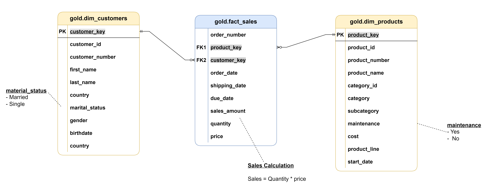

# SQL---DataWarehouseProject


Welcome to the **Data Warehouse and Analytics Project** repository! 🚀  
This project demonstrates a comprehensive data warehousing and analytics solution, from building a data warehouse to generating actionable insights. Designed as a portfolio project, it highlights industry best practices in data engineering and analytics.

---
## 🏗️ Data Architecture

The data architecture for this project follows Medallion Architecture **Bronze**, **Silver**, and **Gold** layers:


1. **Bronze Layer**: Stores raw data as-is from the source systems. Data is ingested from CSV files into a PostgreSQL database.
2. **Silver Layer**: This layer includes data cleansing, standardization, and normalization processes to prepare data for analysis.
3. **Gold Layer**: Houses business-ready data modeled into a star schema required for reporting and analytics.

---
## 📖 Project Overview

This project involves:

1. **Data Architecture**: Designing a Modern Data Warehouse Using Medallion Architecture **Bronze**, **Silver**, and **Gold** layers.
2. **ETL Pipelines**: Extracting, transforming, and loading data from source systems into the warehouse.
3. **Data Modeling**: Developing fact and dimension tables optimized for analytical queries.
4. **Analytics & Reporting**: Creating SQL-based reports and dashboards for actionable insights.

🎯 This repository is an excellent resource for professionals and students looking to showcase expertise in:
- SQL Development
- Data Architect
- Data Engineering  
- ETL Pipeline Developer  
- Data Modeling  
- Data Analytics  

---

## 🚀 Project Requirements

### Building the Data Warehouse (Data Engineering)

#### Objective
Develop a modern data warehouse using PostgreSQL to consolidate sales data, enabling analytical reporting and informed decision-making.

#### Specifications
- **Data Sources**: Import data from two source systems (ERP and CRM) provided as CSV files.
- **Data Quality**: Cleanse and resolve data quality issues prior to analysis.
- **Integration**: Combine both sources into a single, user-friendly data model designed for analytical queries.
- **Scope**: Focus on the latest dataset only; historization of data is not required.
- **Documentation**: Provide clear documentation of the data model to support both business stakeholders and analytics teams.

---

### BI: Analytics & Reporting (Data Analysis)

#### Objective
Develop SQL-based analytics to deliver detailed insights into:
- **Customer Behavior**
- **Product Performance**
- **Sales Trends**

These insights empower stakeholders with key business metrics, enabling strategic decision-making.  

For more details, see the [data catalog](docs/data_catalog.md) and [naming conventions](docs/naming_conventions.md).

---
## 🗺️ Data Model (Gold Layer)



More diagrams: [data flow](docs/figures/data_flow.png), [data integration](docs/figures/data_integration.png), [ETL methods](docs/figures/ETL.png).

---
## ▶️ How to Run (PostgreSQL)

1. Put the CSV files where the PostgreSQL server can read them (default: `/Users/Shared/datasets/source_crm` and `/Users/Shared/datasets/source_erp`), or edit the paths in `scripts/bronze/proc_load_bronze.sql`.
2. Run the scripts in this order:

```bash
psql -U postgres -d postgres      -f scripts/init_database.sql
psql -U postgres -d datawarehouse -f scripts/bronze/ddl_bronze.sql
psql -U postgres -d datawarehouse -f scripts/bronze/proc_load_bronze.sql
psql -U postgres -d datawarehouse -f scripts/silver/ddl_silver.sql
psql -U postgres -d datawarehouse -f scripts/silver/proc_load_silver.sql
psql -U postgres -d datawarehouse -c "CALL bronze.load_bronze();"
psql -U postgres -d datawarehouse -c "CALL silver.load_silver();"
psql -U postgres -d datawarehouse -f scripts/gold/ddl_gold.sql
```

3. Check data quality with `tests/quality_checks_silver.sql` and `tests/quality_checks_gold.sql`.

---
## 📂 Repository Structure
```
SQL---DataWarehouseProject/
│
├── datasets/                           # Raw datasets used for the project (ERP and CRM data)
│
├── docs/                               # Project documentation
│   ├── figures/                        # Diagrams as images (architecture, data flow, data model, ETL)
│   ├── drawio/                         # Editable Draw.io sources for the diagrams
│   ├── data_catalog.md                 # Gold layer tables and column descriptions
│   ├── naming_conventions.md           # Naming rules for tables, columns and procedures
│   └── data_layers.pdf                 # Overview of the Bronze / Silver / Gold layers
│
├── scripts/                            # PostgreSQL scripts
│   ├── init_database.sql               # Creates the database and schemas
│   ├── bronze/                         # Bronze tables + procedure to load CSV files
│   ├── silver/                         # Silver tables + procedure to clean and load data
│   ├── gold/                           # Gold star-schema views
│   └── exploration/                    # Early working queries (data profiling, drafts) - not part of the pipeline
│
├── tests/                              # Data quality checks for silver and gold
│
├── README.md                           # Project overview and instructions
└── LICENSE                             # License information
```
